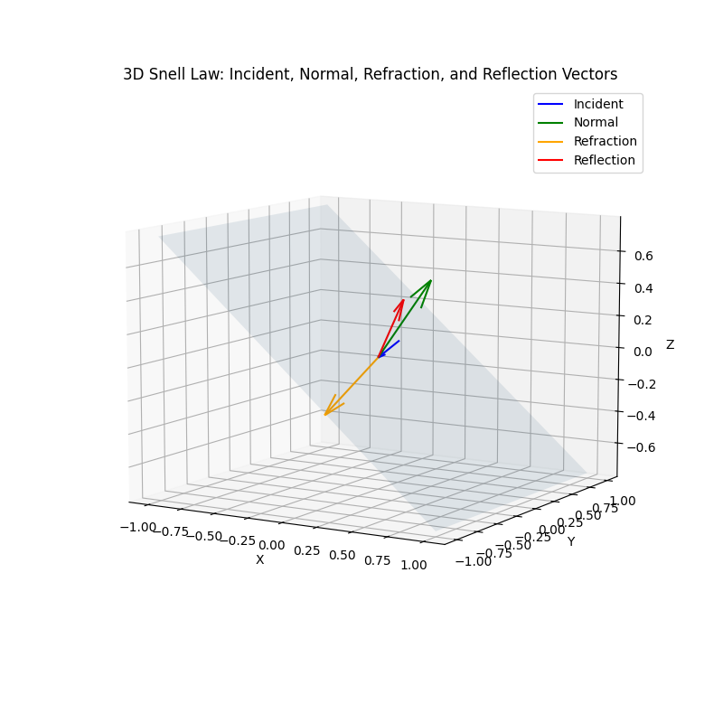

# Snell\_ND

> Tools for computing and visualizing generalized Snell’s Law in nondestructive testing contexts.

## 📄 Project Overview

This repository provides Python scripts to:

* **Compute refraction and reflection vectors** using generalized Snell’s Law for 3D incident rays.
* **Visualize** the results in a 3D plot showing the incident, normal, refracted, and reflected vectors against the interface plane.

## 🛠 Repository Structure

```
snell_ND/
├── generalized_snell.py        # Functions: snell() and snell_batch() for vector calculations
├── generalized_snell_plot.py   # Script: imports snell(), plots vectors and interface plane in 3D
├── requirements.txt            # Python dependencies
└── README.md                   # Project documentation
```

## 🔧 Installation

1. **Clone the repository**

   ```bash
   git clone https://github.com/vhrm19/snell_ND.git
   cd snell_ND
   ```

2. **Create a virtual environment** (recommended)

   ```bash
   python3 -m venv venv
   source venv/bin/activate  # Linux/macOS
   venv\\Scripts\\activate # Windows
   ```

3. **Install dependencies**

   ```bash
   pip install -r requirements.txt
   ```

## 🚀 Usage

### 1. Computing Vectors in Python

Import and call functions in an interactive session or another script:

```python
from generalized_snell import snell, snell_batch
import numpy as np

# Single incident vector
incident = np.array([0.1, 0.1, 0.1])
normal   = np.array([0.78,  0.0, 1.0])
v1, v2 = 1.0, 2.0

T, R = snell(incident, normal, v1, v2)
print("Refraction vector:", T)
print("Reflection vector:", R)

# Batch of vectors
incidents = np.array([[0.1, 0.1, 0.1], [0.2, 0.0, 0.1]])
normals   = np.tile(normal, (2, 1))
T_batch, R_batch = snell_batch(incidents, normals, v1, v2)
print("Batch refractions:", T_batch)
```

### 2. Plotting in 3D

Run the plotting script to open an interactive 3D window:

```bash
python generalized_snell_plot.py
```

This will render:

* The **interface plane**.
* **Incident**, **Normal**, **Refraction**, and **Reflection** vectors.

## 📈 Example Output


*Example 3D visualization of Snell’s law vectors.*

## 📝 Contributing

Contributions, issues, and feature requests are welcome! Feel free to:

* Fork the project.
* Create a new branch for your feature or bugfix.
* Submit a pull request.

## 📜 License

This project is licensed under the MIT License. See [LICENSE](LICENSE) for details.
